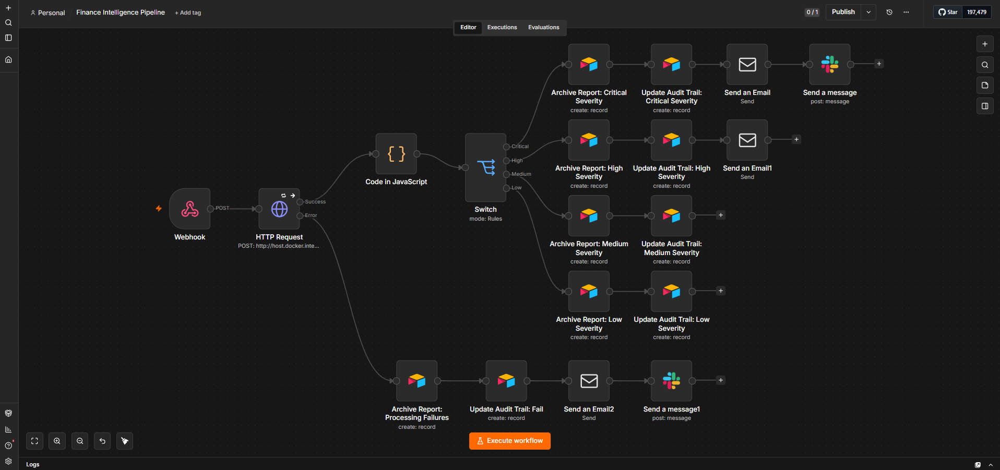
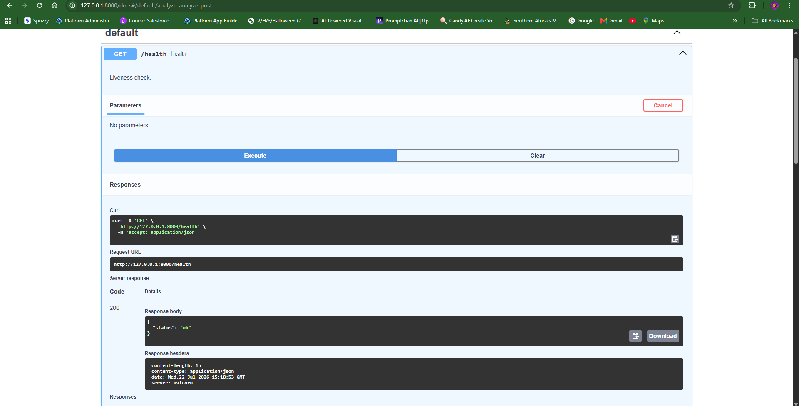
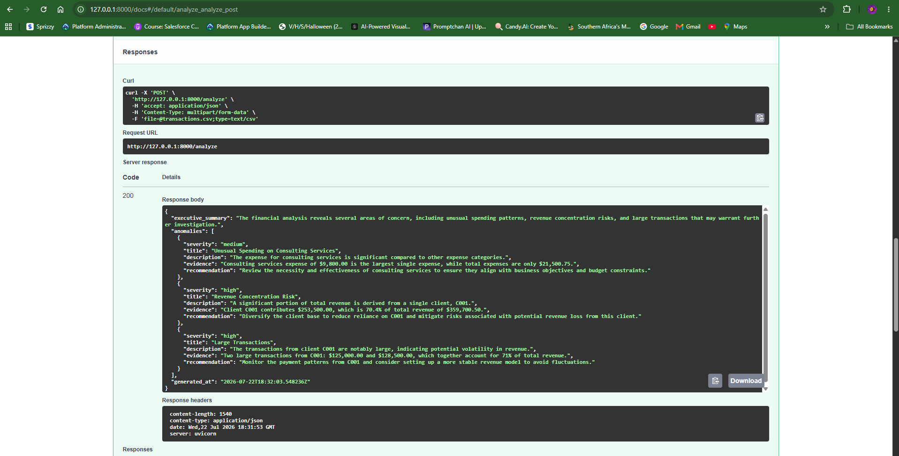
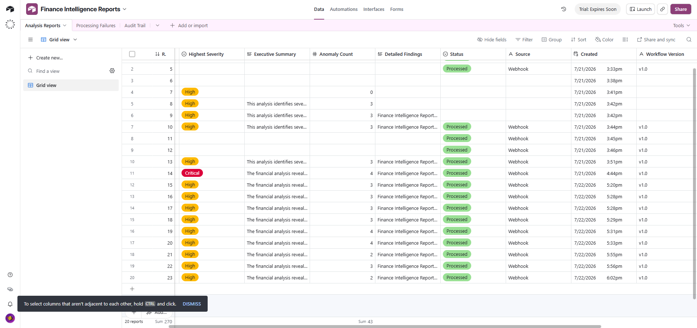
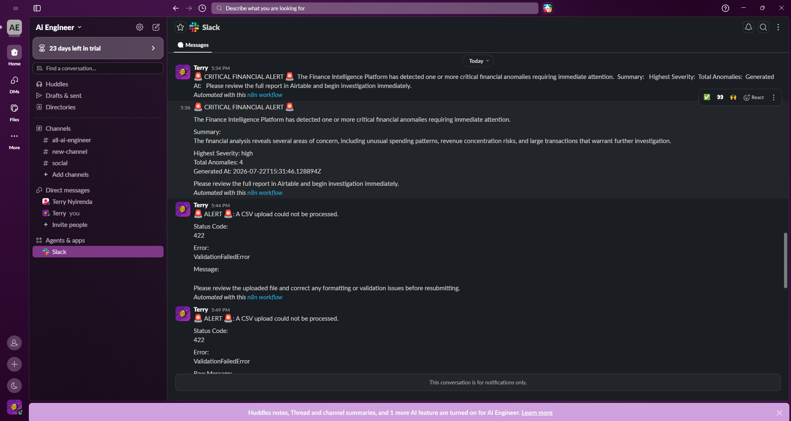
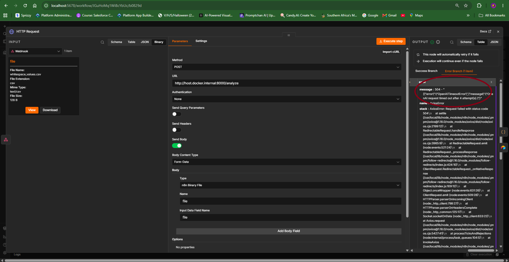

# Finance Intelligence Platform


## Executive Summary

**Client:** Horizon Capital Partners

The Finance Intelligence Platform is an AI-assisted system that automates the
ingestion, validation, analysis, and reporting of financial data. It is being
built for Horizon Capital Partners to cut daily analyst workload from hours to
minutes while preserving the accuracy and auditability required in a finance
context.

## Requirements

- Python 3.11+
- OpenAI API key
- n8n (for workflow orchestration)
- Airtable account and base
- Slack workspace (optional, for notifications)

## Quick Start

```bash
git clone https://github.com/Terrytd0/Finance-Intelligence-Platform.git

cd Finance-Intelligence-Platform

python -m venv .venv

pip install -r requirements.txt

uvicorn src.api.main:app --reload
```

Open your browser:

http://127.0.0.1:8000/docs

Upload:

data/sample/valid_transactions.csv

Click Execute.

## Business Problem

Analysts currently spend 2–3 hours a day on manual, repetitive work:

- Cleaning and reconciling spreadsheets
- Calculating KPIs by hand
- Identifying anomalies in the numbers
- Writing executive summaries
- Distributing reports to stakeholders

Horizon Capital Partners wants this workload reduced to under 15 minutes per
day without sacrificing accuracy or the ability to audit how a number or
conclusion was produced.

## Success Criteria

The platform is considered successful when it delivers, end-to-end:

- **Upload-triggered ingestion** A user uploads a CSV/Excel file, which automatically starts the processing pipeline.
- **Validation** that catches data quality issues before they reach reports
- **KPI calculation** consistent with current analyst methodology
- **Anomaly detection** that surfaces issues analysts would otherwise catch manually
- **Executive reporting** that is clear and decision-ready
- **Notifications** so stakeholders are alerted without manual distribution
- **Audit logging** so every figure and conclusion can be traced back to its source
- **Scalable architecture** that holds up as data volume and client count grow

## Proposed Solution

An automated pipeline that mirrors the analyst workflow it replaces, so
behavior stays explainable and easy to validate against current practice:

1. **Ingestion** — pull in raw financial data from source systems/spreadsheets
2. **Validation** — check data quality and flag issues before they propagate
3. **KPI Calculation** — compute the same metrics analysts calculate today
4. **Anomaly Detection** — AI analyzes the calculated KPIs and transaction data to identify unusual financial patterns and generate structured anomaly reports.
5. **Executive Reporting** — generate summaries suited for decision-makers
6. **Notifications** — distribute reports/alerts to reviewers automatically who then send to stakeholders once approved.
7. **Audit Logging** — record how each figure and conclusion was derived, for traceability

Each stage is designed to be independently reviewable, so a human can verify
or override any step without re-deriving the whole pipeline.

## High-Level Architecture

_Detailed component and data-flow design is tracked in
[`docs/architecture.md`](docs/architecture.md); architectural decisions and
their trade-offs are recorded in [`docs/decisions.md`](docs/decisions.md) as
they're made._

At a high level, the system follows the pipeline above: data flows from
ingestion through validation, KPI calculation, and anomaly detection, into
reporting and notification, with audit logging running alongside every stage
to keep the process traceable end to end.

### Workflow Architecture

See the workflow implemented in n8n:


## Technology Stack

_Full stack decisions and their trade-offs are recorded in
[`docs/decisions.md`](docs/decisions.md) as they're made. What's locked in
so far, driven directly by what's implemented in `src/`:_

- **FastAPI** (`src/api/`) — HTTP entry point into the pipeline.
- **OpenAI Python SDK** (`src/ai/openai_client.py`) — the concrete LLM
  provider behind anomaly detection; swappable, since `src/ai/anomaly_detector.py`
  only depends on the provider-agnostic `LLMClient` protocol.
- **openpyxl** — `.xlsx` ingestion.
- **n8n** — workflow orchestration in front of the FastAPI backend
  ([ADR-001](docs/decisions.md), [`n8n/`](n8n/)).
- **Airtable** — report archive and audit-trail storage, written from the
  n8n workflow (MVP-scale; see
  [`docs/scalability-10k-records-per-day.md`](docs/scalability-10k-records-per-day.md)
  for its long-term limits).
- **Slack / Email (Gmail)** — severity-routed stakeholder notifications,
  sent from the n8n workflow.
- Hosting/deployment remains open per `docs/decisions.md`.

## Supported Financial Data

Version 1 of the platform processes:

- Revenue reports
- Expense reports
- Budget vs Actual reports
- Monthly P&L statements
- Cash flow summaries
- Financial KPI exports

## Key Features

- Automated spreadsheet ingestion (`src/ingestion/`)
- Intelligent validation (`src/ingestion/validator.py`)
- Financial KPI engine (`src/analytics/kpi_engine.py`)
- AI anomaly detection (`src/ai/anomaly_detector.py`)
- Executive summary generation (`src/ai/prompt_builder.py` +
  `anomaly_detector.py`)
- Production HTTP API (`src/api/`) — `POST /analyze` runs an uploaded CSV
  through the full pipeline end-to-end and returns the `AnomalyReport` as JSON
- OpenAI-backed LLM client with exponential-backoff retries on transient
  failures (`src/ai/openai_client.py`)
- Structured JSON error responses with no raw tracebacks exposed
  (`src/api/errors.py`)
- Console + rotating file logging (`src/logging_config.py`)
- Audit trail and per-severity workflow branching (n8n)
- Email & Slack notifications

The current architecture runs as a single FastAPI instance processing one
upload per request — appropriate for the MVP's validated use case, but not
yet proven at production volume. See
[`docs/performance-optimization.md`](docs/performance-optimization.md) and
[`docs/scalability-10k-records-per-day.md`](docs/scalability-10k-records-per-day.md)
for an honest accounting of current bottlenecks versus what horizontal
scaling would require.

## Future Enhancements

- Interactive dashboard
- Scheduled report generation
- Multi-company support
- Predictive forecasting
- Role-based access — design specified in
  [`docs/role-based-access-design.md`](docs/role-based-access-design.md);
  not yet implemented (no authentication exists in `src/api/` today)
- Approval workflows — report sign-off flow specified in
  [`docs/role-based-access-design.md`](docs/role-based-access-design.md#approval-workflow-and-report-status);
  not yet implemented
- Batch processing — architecture specified in
  [`docs/batch-processing.md`](docs/batch-processing.md); uploads are
  processed one file per request today
- Enterprise-scale throughput (10,000+ records/day) — gap analysis and
  roadmap in
  [`docs/scalability-10k-records-per-day.md`](docs/scalability-10k-records-per-day.md)
- Centralized monitoring & observability — current capabilities and gaps
  documented in [`docs/monitoring-metrics.md`](docs/monitoring-metrics.md)
- ERP integrations (SAP, Oracle, Dynamics)

## Repository Structure

```
Finance-Intelligence-Platform/
│
├── README.md
├── CLAUDE.md
├── LICENSE
├── .gitignore
├── requirements.txt
├── conftest.py
│
├── docs/
│   ├── architecture.md
│   ├── assumptions_and_open_questions.md
│   ├── automated-test-coverage.md
│   ├── batch-processing.md
│   ├── Business_Requirements.md
│   ├── data_schema.md
│   ├── decisions.md
│   ├── design_review.md
│   ├── monitoring-metrics.md
│   ├── performance-optimization.md
│   ├── role-based-access-design.md
│   ├── scalability-10k-records-per-day.md
│   ├── test-scenarios.md
│   └── validation_rules.md
│
├── data/
│   ├── raw/
│   │   ├── transactions.csv
│   │   ├── transactions.xlsx
│   │   └── clients.csv
│   │
│   ├── processed/          (pipeline output, gitignored)
│   │
│   └── sample/
│       ├── valid_transactions.csv
│       ├── duplicate_transactions.csv
│       ├── missing_values.csv
│       ├── invalid_data.csv
│       ├── lowercase_currency.csv
│       ├── whitespace_values.csv
│       ├── malformed.csv
│       ├── partial_invalid.csv
│       └── Empty.csv
│
├── src/
│   ├── __init__.py
│   ├── config.py
│   ├── logging_config.py
│   │
│   ├── ingestion/
│   │   ├── __init__.py
│   │   ├── reader.py
│   │   ├── validator.py
│   │   ├── cleaner.py
│   │   ├── deduplicator.py
│   │   └── pipeline.py
│   │
│   ├── analytics/
│   │   ├── __init__.py
│   │   └── kpi_engine.py
│   │
│   ├── ai/
│   │   ├── prompt_builder.py
│   │   ├── anomaly_detector.py
│   │   └── openai_client.py
│   │
│   ├── api/
│   │   ├── __init__.py
│   │   ├── main.py
│   │   ├── errors.py
│   │   └── schemas.py
│   │
│   └── models/
│       ├── __init__.py
│       └── financial_schema.py
│
├── tests/
│   ├── test_ingestion.py
│   ├── test_kpi_engine.py
│   ├── test_prompt_builder.py
│   ├── test_anomaly_detector.py
│   ├── test_openai_client.py
│   └── test_api.py
│
├── logs/                  (generated at runtime, gitignored)
│
├── n8n/
│   ├── README.md
│   └── Finance-Intelligence-Pipeline.json
│
├── workflows/             (placeholder — reserved for future exported workflow variants)
│
├── assets/
│   ├── airtable/
│   │   ├── Analysis Report Table.png
│   │   ├── Anomaly Report n8n structured Output.png
│   │   ├── Audit Trail Table.png
│   │   └── Processing Failure Table.png
│   │
│   ├── api/
│   │   ├── Anomaly Report Swagger Output.png
│   │   └── Health Check.png
│   │
│   ├── architecture/
│   │   └── n8n workflow.png
│   │
│   ├── notifications/
│   │   ├── Automated Email.png
│   │   └── Automated Slack Alert.png
│   │
│   └── testing/
│       └── Retry Handling.png
│
└── examples/              (placeholder — reserved for future sample end-to-end runs)
```

The `src/ingestion` pipeline (Read → Validate → Clean → Deduplicate) is a
concrete, testable implementation of the Validation and Cleaning stages
described above, and the sample data under `data/sample/` doubles as its
test fixtures — see [`docs/data_schema.md`](docs/data_schema.md) and
[`docs/validation_rules.md`](docs/validation_rules.md) for the contract it
implements. Excel files are read with `openpyxl` (see `requirements.txt`),
so it handles real-world `.xlsx` edge cases — formulas, merged cells,
hidden sheets — rather than a hand-rolled parser.

## Analytics & AI Reporting Layer

Once transactions are ingested and cleaned, two further stages compute the
KPI Calculation and AI-assisted Anomaly Detection / Executive Reporting
steps from the pipeline above:

- **`src/analytics/kpi_engine.py`** — deterministic, non-AI KPI
  calculations (`generate_kpis`). Computes total revenue, total expenses,
  net profit, revenue by client, expenses by category, monthly totals, and
  the largest transactions from a batch of validated `Transaction` records.
  Every figure here is reproducible from the transaction data alone, which
  keeps the numbers the AI layer reasons over auditable.
- **`src/ai/prompt_builder.py`** — formats a `FinancialKPIs` snapshot and
  the underlying transactions into a structured prompt
  (`build_anomaly_prompt`). It performs no calculations of its own; it only
  renders figures already computed by the KPI engine, and instructs the
  model to reason solely from the supplied data rather than inventing or
  recomputing numbers.
- **`src/ai/anomaly_detector.py`** — sends that prompt to an injected
  `LLMClient` (a small `Protocol`, so the module has no dependency on any
  specific provider), then parses and validates the JSON response into
  typed `FinancialAnomaly` / `AnomalyReport` dataclasses. Malformed or
  schema-invalid responses raise `LLMResponseError` rather than being
  silently accepted, so downstream reporting can trust the shape of an
  `AnomalyReport`.

This split — deterministic math in `analytics/`, everything AI-facing in
`ai/` — keeps KPI figures explainable and independently testable, while
containing prompt/response handling (and the risk of model
hallucination) to a single, narrow boundary.

## Production API Layer

`src/api/` puts the whole pipeline behind HTTP, orchestrating the existing
ingestion, analytics, and AI modules without duplicating any of their logic:

```
CSV → FastAPI → Pipeline → KPI Engine → Prompt Builder →
OpenAILLMClient → OpenAI → Anomaly Detector → JSON Response
```

- **`GET /health`** — liveness check, returns `{"status": "ok"}`.
- **`POST /analyze`** — accepts an uploaded `.csv` file, runs it through
  `run_pipeline()` → `generate_kpis()` → `generate_anomaly_report()`
  unchanged, and returns the resulting `AnomalyReport` as JSON
  (`src/api/schemas.py`).
- **`src/ai/openai_client.py`** — `OpenAILLMClient`, the concrete
  implementation of the `LLMClient` protocol `anomaly_detector.py` expects.
  Retries transient network/API failures (connection errors, timeouts, rate
  limits, 5xx) with exponential backoff; non-retryable errors and malformed
  responses raise immediately.
- **`src/config.py`** — all tunables (OpenAI model, timeout, temperature,
  retry count, log level) read from environment variables, no hardcoded
  secrets.
- **`src/logging_config.py`** — console + rotating file logging
  (`logs/app.log`) with a consistent timestamp/level/module/message format.
- **`src/api/errors.py`** — every failure mode (bad upload, unreadable CSV,
  validation failure, malformed LLM response, OpenAI failure/timeout,
  missing config, or anything unexpected) is caught and returned as
  `{"error": "<Type>", "message": "<detail>"}` with an appropriate HTTP
  status code — never a raw Python traceback.

## Workflow Orchestration (n8n)

Per [ADR-001](docs/decisions.md), n8n is the orchestration platform sitting
in front of the FastAPI backend, implementing the Notifications and Audit
Logging stages from the Proposed Solution above:

- **`n8n/Finance-Intelligence-Pipeline.json`** — the importable workflow. A
  `Webhook` trigger calls the FastAPI `/analyze` endpoint (`HTTP Request`
  node), then a `Switch` routes on the returned anomaly severity
  (low/medium/high/critical) to per-severity Airtable "Archive Report" and
  "Update Audit Trail" nodes, plus Slack/Email notification nodes; a
  separate failure branch archives and audits processing errors instead of
  silently dropping them.
- **`n8n/README.md`** — import instructions and requirements: n8n v2.x, the
  FastAPI backend reachable at `http://host.docker.internal:8000` (i.e.
  `src/api/main.py` running via `uvicorn`), plus configured Airtable, Slack,
  and Email credentials.

This workflow is the consumer of the API layer above — `src/api/` and
`n8n/` are designed to be run together, not as alternatives.

## Testing

The automated suite covers every module in `src/` end to end — ingestion,
KPI calculation, prompt building, AI response parsing, the OpenAI client's
retry/backoff behavior, and the FastAPI endpoints — with no test making a
real network call (LLM calls are faked or mocked throughout):

```
python -m pytest -q
# 65 passed
```

- [`docs/automated-test-coverage.md`](docs/automated-test-coverage.md) —
  per-test breakdown of what feature each test covers and what scenario it
  verifies, for all 6 files in `tests/`.
- [`docs/test-scenarios.md`](docs/test-scenarios.md) — manual, end-to-end
  scenarios (CSV/XLSX upload, validation failures, OpenAI timeout retries,
  the health endpoint) exercised through the Swagger UI and the full n8n
  workflow, as a complement to the automated suite above.

## Screenshots

Evidence of the platform running end-to-end, captured from the sample
data in `data/` and the imported n8n workflow. Full-resolution originals
are organized by area under [`assets/`](assets/).

| | |
| --- | --- |
|  **n8n workflow** — the imported pipeline, from `Webhook` through severity-based routing to Airtable and Slack/Email. |  **`GET /health`** — liveness check via the FastAPI Swagger UI. |
|  **`POST /analyze` response** — a full `AnomalyReport` returned from the Swagger UI. |  **Airtable — Analysis Report** — an archived report row per the n8n Data Storage stage. |
|  **Slack notification** — a severity-routed alert sent by the n8n workflow. |  **Retry handling** — `OpenAILLMClient` retrying a transient OpenAI failure with exponential backoff. |

## Design & Operations Documentation

Beyond the pipeline docs referenced above, `docs/` contains a set of
enterprise architecture reviews. Each one inspects the current
implementation directly, distinguishes what's built from what's proposed,
and is explicit that the proposals are **not** implemented:

| Document | Covers | Status |
| --- | --- | --- |
| [`docs/role-based-access-design.md`](docs/role-based-access-design.md) | Roles, permissions, report approval, and alert routing | Design only — no authentication exists in `src/api/` today |
| [`docs/performance-optimization.md`](docs/performance-optimization.md) | Optimizations already in the pipeline vs. enterprise-scale recommendations | Mixed — documents both what's implemented and what's proposed |
| [`docs/batch-processing.md`](docs/batch-processing.md) | How uploads are processed today and how batch processing could be introduced | Design only — uploads are single-file, single-request today |
| [`docs/scalability-10k-records-per-day.md`](docs/scalability-10k-records-per-day.md) | Current scalability constraints and a roadmap toward 10,000+ records/day | Design only — this volume has not been load-tested or achieved |
| [`docs/monitoring-metrics.md`](docs/monitoring-metrics.md) | Current logging/audit visibility vs. a centralized observability architecture | Mixed — documents both what's implemented and what's proposed |

None of these documents change the underlying pipeline described above
(`Read → Validate → Clean → Dedupe → KPI Engine → AI → Store → Notify`);
each treats its proposed architecture as an extension of it, not a
replacement.

Project history and standing decisions, for how the above came to be:

| Document | Covers | Status |
| --- | --- | --- |
| [`docs/Business_Requirements.md`](docs/Business_Requirements.md) | The original business problem and requirements from Horizon Capital Partners | Source requirements |
| [`docs/design_review.md`](docs/design_review.md) | A pre-build architecture review (2026-07-18) — gaps, risks, and recommendations against the requirements and `decisions.md` | Historical — **APPROVED WITH RECOMMENDATIONS**; several recommendations (e.g. deterministic anomaly detection ahead of the LLM step) remain open, see [`docs/architecture.md`](docs/architecture.md#anomaly-detection-approach) |
| [`docs/assumptions_and_open_questions.md`](docs/assumptions_and_open_questions.md) | Open questions raised before implementation began (definition of "anomaly," data volume, approval ownership, accuracy target) | Still open — not yet answered by the client |
| [`docs/decisions.md`](docs/decisions.md) | Architecture Decision Records | ADR-001 (n8n) accepted; no ADR yet for OpenAI or Airtable, a gap `design_review.md` flags |

